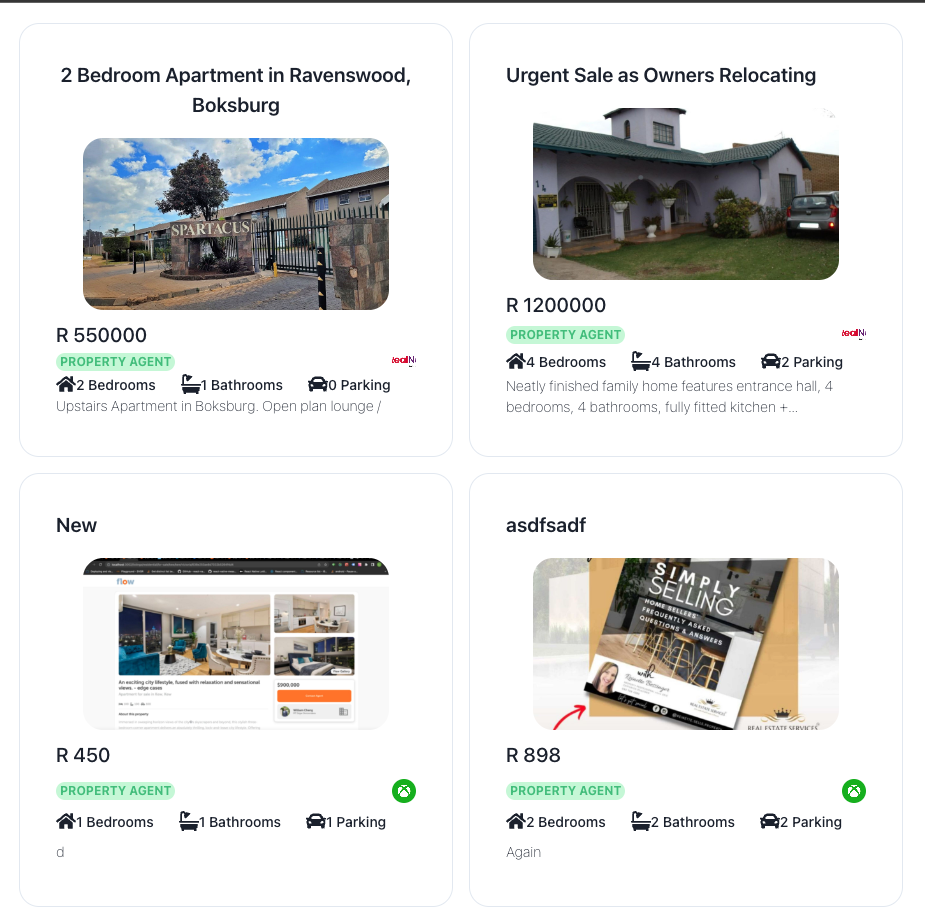

# Prop Listing UI
## Table of Contents

- [Overview](#Overview)
- [Getting Started](#getting-started)
- [Docker](#docker)
- [Contributing to the Project](#contributing-to-the-project)
- [Other](#other)
- [Meta](#meta)

## Overview

A frontend ui for displaying property listing, using backend lamdba api built with nestjs api

* debounce
* distinctUntilChanged



## Getting Started

These instructions will get you a copy of the project up and running on your local machine for development and testing purposes.

### Environment Variables 
An example of environment variabes is included needed for duplication `.env.example` and copy into `.env`

### Project start

#### Install Dependencies
1. Get Yarn
``
    npm -g install yarn
``
2. Install Dependencies
``
yarn install
``
3. Compiles for development
``
yarn serve
``
4. Compiles and minifies for production
``
yarn build
``
5. Lints and fixes files
``
yarn lint
``
## Docker
This project has been dockerized for purpose of deployment, so proceed with steps below if you consider deploying with docker

#### Build Docker Image
```
docker build . -t app-ui/health-frontend
docker run -it -p 8080:80 --env-file=.env --rm --name health-frontend-ui app-ui/health-frontend
```

## Contributing to the Project

For detailed guidelines on how to create custom branches according to contribution follow
Refer to `CONTRIBUTING.md`
## Other

See the installation guides available @ nodejs.org:

https://nodejs.org/en/download/package-manager/

## Meta

| Version | Author                                          | Date       |
| ------- | ----------------------------------------------- | ---------- |
| 0.0.1   | Jameel Geduld <jameel.wilite@gmail.com> | 16/02/2023 |

